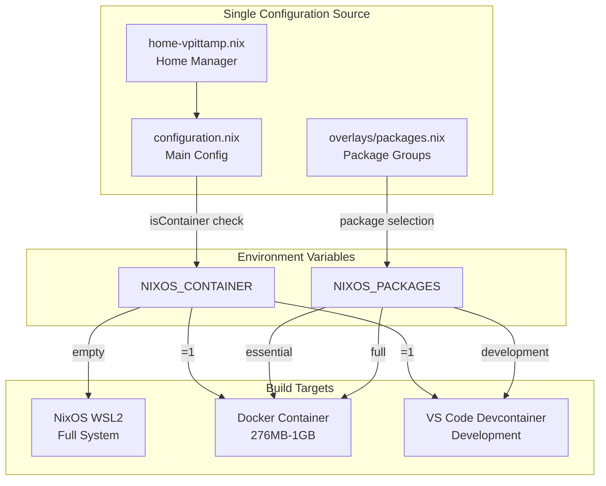
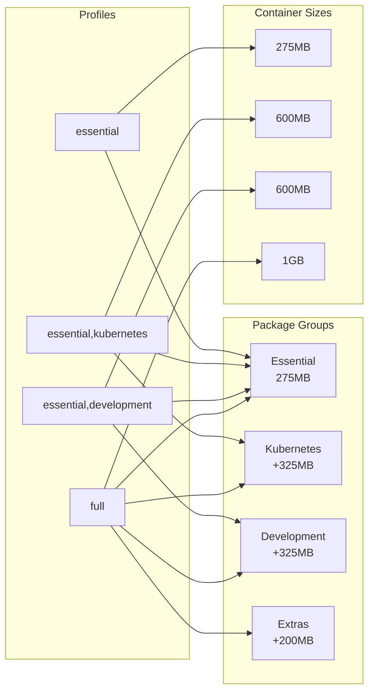
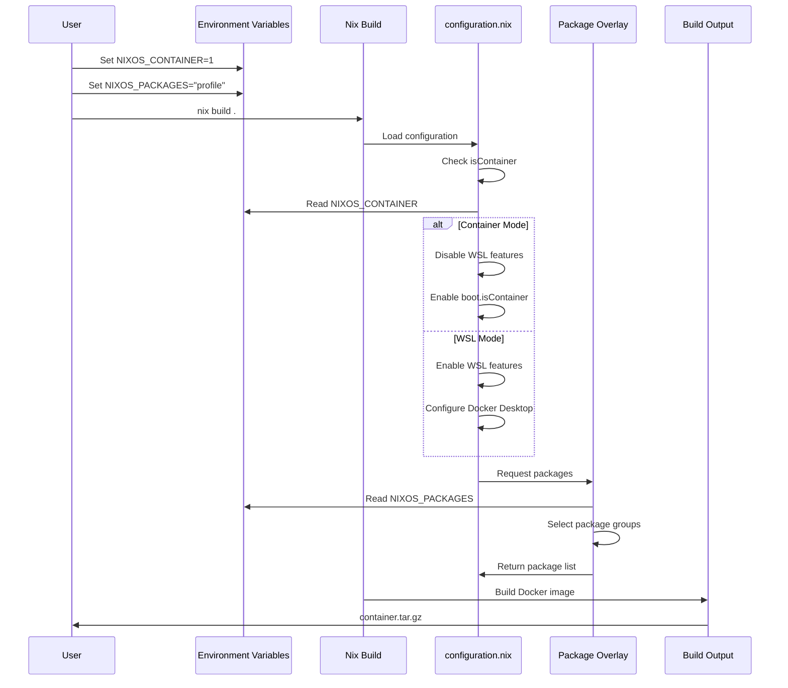
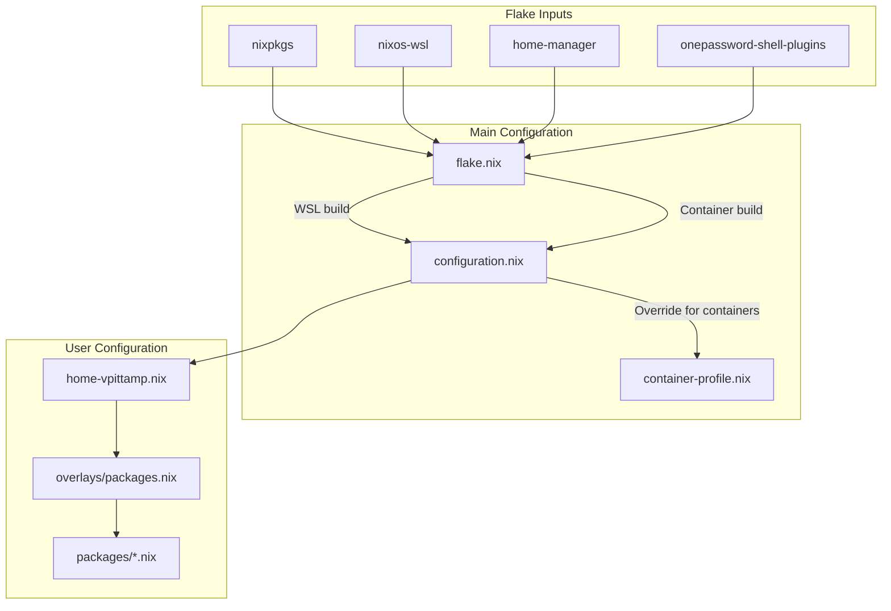
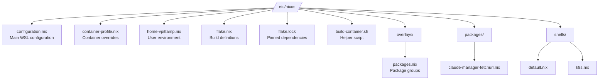
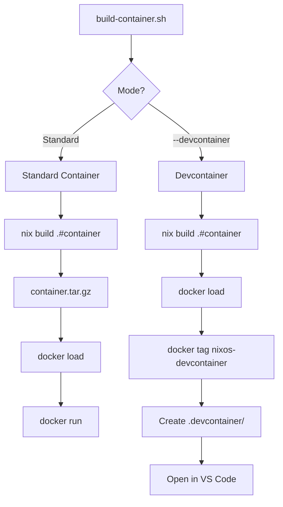
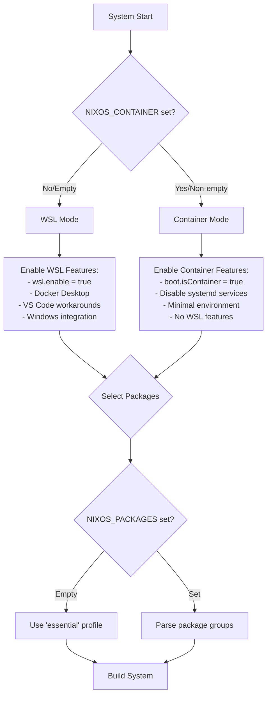
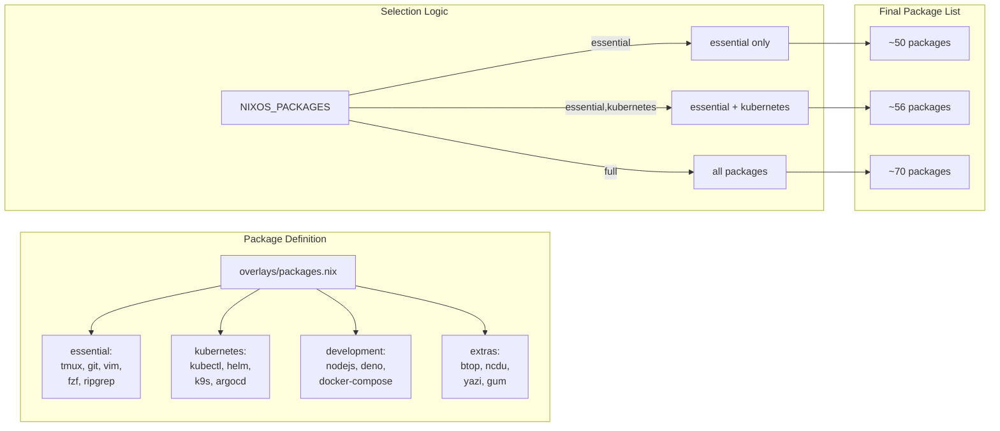
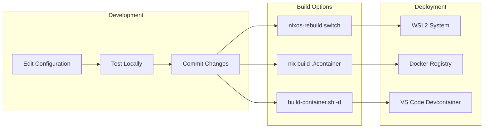
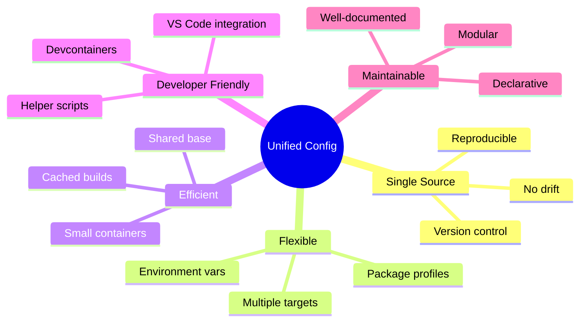

# NixOS Configuration Architecture Diagrams

## System Overview

## Package Selection Flow

## Build Process

## Configuration Hierarchy

## File Structure

## Container Build Modes

## Environment Detection Logic

## Package Overlay System

## Usage Workflow

## Benefits Visualization

