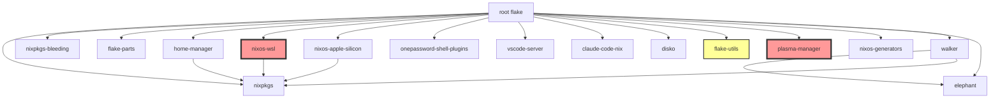

# Flake Input Validation Research

## Overview

This document provides a systematic methodology for verifying that flake inputs in a NixOS flake are unused and safe to remove. This is critical when cleaning up flake configurations to avoid unnecessary dependencies, reduce build times, and maintain a lean dependency graph.

---

## 1. Flake Outputs Analysis

### 1.1 Standard Flake Output Types

NixOS flakes can export various output types, each potentially consuming flake inputs:

| Output Type | Description | Common Input Usage |
|-------------|-------------|-------------------|
| `nixosConfigurations` | Complete NixOS system definitions | All system modules, hardware support (e.g., `nixos-apple-silicon`, `nixos-wsl`) |
| `homeConfigurations` | Standalone Home Manager configs (non-NixOS) | Home Manager modules, user tools |
| `packages` | Derivations (container images, VM images) | Build tools (e.g., `nixos-generators`), containerization |
| `devShells` | Development environments | Development tools, language-specific packages |
| `checks` | Test derivations for `nix flake check` | Testing frameworks, linters |
| `apps` | Runnable applications via `nix run` | Application dependencies |
| `overlays` | Package overrides for nixpkgs | Modified packages |
| `nixosModules` | Reusable NixOS modules | Shared configuration logic |
| `homeModules` | Reusable Home Manager modules | Shared user-level configuration |

### 1.2 Commands to Inspect Outputs

```bash
# Show all flake outputs with hierarchical structure
nix flake show

# Show outputs as JSON (for programmatic inspection)
nix flake show --json | jq

# List all output attributes
nix eval --json .# --apply 'builtins.attrNames' | jq

# List NixOS configurations
nix eval --json .#nixosConfigurations --apply 'builtins.attrNames'
# Output: ["hetzner-sway","m1"]

# List Home Manager configurations
nix eval --json .#homeConfigurations --apply 'builtins.attrNames'
# Output: ["code","darwin"]

# List packages for current system
nix eval --json .#packages.${builtins.currentSystem} --apply 'builtins.attrNames'

# List devShells for current system
nix eval --json .#devShells.${builtins.currentSystem} --apply 'builtins.attrNames'

# List checks for current system
nix eval --json .#checks.${builtins.currentSystem} --apply 'builtins.attrNames'

# Evaluate specific configuration (to check if it builds)
nix eval --raw .#nixosConfigurations.hetzner-sway.config.networking.hostName
# Output: nixos-hetzner-sway

# Inspect flake metadata
nix flake metadata
nix flake metadata --json | jq
```

### 1.3 How Outputs Consume Inputs

#### NixOS Configurations
- **Direct imports**: `inputs.plasma-manager.homeModules.plasma-manager`
- **Module imports**: `inputs.nixos-apple-silicon.nixosModules.default`
- **Package overlays**: `inputs.walker.packages.${pkgs.system}.default`
- **Passed to specialArgs**: `specialArgs = { inherit inputs; }`

#### Home Manager Configurations
- **Home modules**: `inputs.onepassword-shell-plugins.hmModules.default`
- **Package references**: `inputs.claude-code-nix.packages.${pkgs.system}.claude-code`

#### Packages
- **Build dependencies**: `nixos-generators.nixosGenerate { ... }`
- **Included in images**: `home-manager.nixosModules.home-manager`

#### DevShells
- **Development tools**: `inputs.some-tool.packages.${pkgs.system}.default`
- **Overlays**: Applied to devShell pkgs

---

## 2. Input Usage Detection

### 2.1 Search Strategies

#### Method 1: Direct Grep for Input References

```bash
# Search for any reference to a specific input
rg "inputs\.plasma-manager" --type nix

# Search for imports of an input's modules
rg "plasma-manager\.(nixosModules|homeModules)" --type nix

# Search for package references
rg "plasma-manager\.packages" --type nix

# Search across all files (including markdown docs)
rg "plasma-manager"

# Case-insensitive search
rg -i "plasma-manager"
```

**Example Output** (plasma-manager):
```
flake.nix:58:    plasma-manager = {
packages/default.nix:78:              inputs.plasma-manager.homeModules.plasma-manager
archived/plasma-specific/home-modules/profiles/plasma-home.nix:    inputs.plasma-manager.homeModules.plasma-manager
```

#### Method 2: Attribute-Specific Searches

```bash
# Search for all input references (catches any input usage)
rg "inputs\.[a-zA-Z0-9_-]+" --type nix

# Search for module imports (common pattern)
rg "inputs\.[a-zA-Z0-9_-]+\.(nixosModules|homeModules)" --type nix

# Search for package references
rg "inputs\.[a-zA-Z0-9_-]+\.packages" --type nix

# Search for flake follows (dependency chain)
rg "inputs\.[a-zA-Z0-9_-]+\.follows" --type nix
```

#### Method 3: Check Imported Files

Many inputs are passed through `specialArgs` and consumed in imported modules:

```bash
# Trace where inputs are passed
rg "specialArgs.*inherit.*inputs" --type nix

# Check all module imports in configurations
find configurations/ -name "*.nix" -exec cat {} \; | rg "imports ="

# Check home-modules for input usage
find home-modules/ -name "*.nix" -exec cat {} \; | rg "inputs\."
```

### 2.2 Common Usage Patterns

| Pattern | Example | Location |
|---------|---------|----------|
| Direct module import | `inputs.plasma-manager.homeModules.plasma-manager` | Configuration files |
| Package reference | `inputs.walker.packages.${pkgs.system}.default` | home-modules, packages |
| Inherit inputs | `specialArgs = { inherit inputs; }` | flake.nix, lib/helpers.nix |
| Follows declaration | `inputs.elephant.follows = "elephant"` | flake.nix inputs section |
| Conditional import | `if osConfig.services.foo then inputs.bar` | home-modules |

### 2.3 Example: Tracing plasma-manager Usage

```bash
# Step 1: Find all references
$ rg "plasma-manager" --type nix

flake.nix:58:    plasma-manager = {
packages/default.nix:78:              inputs.plasma-manager.homeModules.plasma-manager

# Step 2: Check the specific file
$ cat packages/default.nix | grep -A 10 -B 10 "plasma-manager"

      # Full KubeVirt VM image (qcow2 with complete desktop + home-manager)
      nixos-kubevirt-full-image = nixos-generators.nixosGenerate {
        inherit system;
        modules = [
          ../configurations/kubevirt-full.nix
          home-manager.nixosModules.home-manager
          (helpers.mkHomeManagerConfig {
            inherit system;
            user = "vpittamp";
            modules = [
              ../home-vpittamp.nix
              inputs.plasma-manager.homeModules.plasma-manager  # <-- USAGE HERE
            ];
          })
        ];
        format = "qcow";
      };

# Step 3: Check if this package is actually used
$ nix eval --json .#packages.aarch64-linux --apply 'builtins.attrNames'
["container-dev","container-minimal","default","hetzner-sway-qcow2","nixos-kubevirt-full-image","nixos-kubevirt-minimal-image","nixos-kubevirt-optimized-image"]

# Step 4: Check configuration files for kubevirt usage
$ ls configurations/ | grep kubevirt
# (no results - files are in archived/obsolete-configs/)

$ ls archived/obsolete-configs/ | grep kubevirt
kubevirt-full.nix
kubevirt-minimal.nix
kubevirt-optimized.nix

# Conclusion: plasma-manager is ONLY used in kubevirt-full package
# This package is archived/obsolete, so plasma-manager is safe to remove
```

---

## 3. Flake Metadata Inspection

### 3.1 Flake Lock Analysis

```bash
# Show all locked inputs
nix flake metadata --json | jq -r '.locks.nodes | keys[]' | sort

# View flake.lock directly
cat flake.lock | jq -r '.nodes | keys[]' | sort

# Example output:
claude-code-nix
disko
elephant
flake-compat
flake-parts
flake-utils
home-manager
nixos-apple-silicon
nixos-generators
nixos-wsl
nixpkgs
nixpkgs-bleeding
onepassword-shell-plugins
plasma-manager
vscode-server
walker
```

**Key Observations**:
- `flake-compat`, `flake-utils`: Often transitive dependencies
- Multiple versions (e.g., `nixpkgs_2`, `home-manager_2`): Indicate different dependency paths

### 3.2 Direct vs Transitive Inputs

**Direct Inputs**: Declared in `flake.nix` inputs section
```nix
inputs = {
  nixpkgs.url = "github:NixOS/nixpkgs/nixos-unstable";
  home-manager = {
    url = "github:nix-community/home-manager/master";
    inputs.nixpkgs.follows = "nixpkgs";  # <-- Makes home-manager's nixpkgs follow ours
  };
}
```

**Transitive Inputs**: Dependencies of direct inputs
- Example: `walker` depends on `elephant`, so `elephant` must also be declared
- Visible in `flake.lock` as `nixpkgs_2`, `flake-utils_2`, etc.

```bash
# Check input relationships in flake.lock
cat flake.lock | jq '.nodes.walker.inputs'
# Output shows: { "elephant": "elephant", "nixpkgs": "nixpkgs_3", ... }

# This means walker needs elephant, which we must also declare
```

### 3.3 Follows Relationships

```nix
inputs = {
  walker = {
    url = "github:abenz1267/walker";
    inputs.elephant.follows = "elephant";  # <-- Reuse our elephant input
  };
  elephant = {
    url = "github:abenz1267/elephant";
  };
}
```

**Why this matters**:
- If you remove `elephant`, `walker` will fail to evaluate
- Use `inputs.<name>.follows` to deduplicate transitive dependencies

---

## 4. Safe Removal Process

### 4.1 Pre-Removal Checklist

1. **Search for all references**:
   ```bash
   rg "<input-name>" --type nix
   rg "inputs\.<input-name>"
   ```

2. **Check all output types**:
   ```bash
   # NixOS configs
   nix eval --json .#nixosConfigurations --apply 'builtins.attrNames'

   # Home Manager configs
   nix eval --json .#homeConfigurations --apply 'builtins.attrNames'

   # Packages (per system)
   nix eval --json .#packages.x86_64-linux --apply 'builtins.attrNames'
   nix eval --json .#packages.aarch64-linux --apply 'builtins.attrNames'

   # DevShells
   nix eval --json .#devShells.aarch64-linux --apply 'builtins.attrNames'

   # Checks
   nix eval --json .#checks.aarch64-linux --apply 'builtins.attrNames'
   ```

3. **Trace inherited inputs**:
   ```bash
   # Check where inputs are passed to modules
   rg "specialArgs.*inherit.*inputs" --type nix
   rg "extraSpecialArgs.*inherit.*inputs" --type nix
   ```

4. **Check archived/obsolete code**:
   ```bash
   # Don't let archived code block removal
   ls archived/ | grep -i "<input-name>"
   rg "<input-name>" archived/
   ```

### 4.2 Removal Steps

**Step 1**: Comment out the input in `flake.nix`
```nix
inputs = {
  # plasma-manager = {
  #   url = "github:nix-community/plasma-manager";
  #   inputs.nixpkgs.follows = "nixpkgs";
  # };
}
```

**Step 2**: Update flake.lock
```bash
# This will remove the input from flake.lock
nix flake lock --update-input plasma-manager 2>&1 || echo "Input removed"

# Or regenerate entire lock file
nix flake update
```

**Step 3**: Test configurations
```bash
# Test all NixOS configurations
sudo nixos-rebuild dry-build --flake .#hetzner-sway
sudo nixos-rebuild dry-build --flake .#m1 --impure

# Test flake check (validates all outputs)
nix flake check

# Test packages
nix build .#container-minimal
nix build .#hetzner-sway-qcow2

# Test devShell
nix develop
```

**Step 4**: Validate flake metadata
```bash
# Check that input is gone from lock file
cat flake.lock | jq -r '.nodes | keys[]' | grep plasma-manager
# (should return nothing)

# Verify no broken references
nix flake show
```

**Step 5**: Remove the input declaration from `flake.nix`
```nix
inputs = {
  # Input removed - was only used in archived kubevirt configurations
}
```

### 4.3 Expected Changes to flake.lock

After removing an input, `flake.lock` should show:

**Before**:
```json
{
  "nodes": {
    "plasma-manager": {
      "locked": { ... },
      "original": { ... }
    }
  }
}
```

**After**:
```json
{
  "nodes": {
    // plasma-manager entry completely removed
  }
}
```

**Transitive dependencies**: If the removed input was only used by one other input via `follows`, those entries may also disappear.

### 4.4 Validation Commands

```bash
# Final validation checklist
nix flake check                               # Validates all outputs
nix flake show                                # Shows structure
nix flake metadata                            # Shows locked inputs
sudo nixos-rebuild dry-build --flake .#<config> --show-trace  # Detailed errors

# Performance check
nix flake metadata | grep -c "^  "            # Count inputs (should decrease)
du -sh ~/.cache/nix/                          # Cache size (may shrink after GC)
nix-store --gc                                # Garbage collect unused inputs
```

---

## 5. Common Pitfalls

### 5.1 Hidden Input Usage in DevShells

**Problem**: Inputs used only in `devShells` won't be detected by `nixos-rebuild dry-build`

**Example**:
```nix
perSystem = { system, pkgs, ... }: {
  devShells.default = pkgs.mkShell {
    buildInputs = [
      inputs.some-linter.packages.${system}.default  # <-- ONLY used here
    ];
  };
};
```

**Detection**:
```bash
# Must test devShell explicitly
nix develop --command echo "Testing devShell"

# Or check devShell evaluation
nix eval .#devShells.${builtins.currentSystem}.default
```

### 5.2 Hidden Input Usage in Packages

**Problem**: Package outputs (containers, VM images) may use inputs not referenced in NixOS configurations

**Example**:
```nix
packages.container-image = dockerTools.buildLayeredImage {
  contents = [ inputs.special-tool.packages.${system}.default ];
};
```

**Detection**:
```bash
# Must test package builds
nix build .#container-minimal
nix build .#nixos-kubevirt-full-image

# Check package derivations
nix show-derivation .#container-minimal | grep -i "<input-name>"
```

### 5.3 Hidden Input Usage in Checks

**Problem**: Test checks may import inputs for validation purposes

**Example**:
```nix
checks.integration-test = pkgs.runCommand "test" {
  buildInputs = [ inputs.test-framework.packages.${system}.default ];
} "...";
```

**Detection**:
```bash
# Run all checks
nix flake check --all-systems

# Test specific check
nix build .#checks.${builtins.currentSystem}.integration-test
```

### 5.4 Overlays Depending on Specific Inputs

**Problem**: Nixpkgs overlays may reference flake inputs

**Example**:
```nix
nixpkgs.overlays = [
  (final: prev: {
    my-package = inputs.external-pkg.packages.${system}.default;
  })
];
```

**Detection**:
```bash
# Search for overlay definitions
rg "nixpkgs\.overlays" --type nix

# Check overlay files
find overlays/ -name "*.nix" -exec cat {} \; | rg "inputs\."
```

### 5.5 Conditional Imports Based on osConfig

**Problem**: Home Manager modules may conditionally import inputs based on NixOS configuration

**Example**:
```nix
home.packages = lib.mkIf config.osConfig.services.plasma.enable [
  inputs.plasma-manager.packages.${pkgs.system}.default
];
```

**Detection**:
```bash
# Search for conditional logic
rg "osConfig.*enable" home-modules/

# Search for mkIf/mkMerge with inputs
rg "mkIf.*inputs\." --type nix
rg "mkMerge.*inputs\." --type nix
```

### 5.6 Inputs Used Only in Archived Code

**Problem**: Archived/obsolete code may reference inputs, blocking removal

**Solution**: Archived code should NOT prevent input removal

```bash
# Identify archived usage
ls archived/ | grep -i "<input-name>"
rg "<input-name>" archived/

# Safe to ignore if:
# 1. No active configurations reference it
# 2. No active packages/checks/devShells use it
# 3. Only found in archived/, docs/, or comments
```

---

## 6. Input-Specific Analysis

### 6.1 Current Flake Inputs (16 total)

| Input | Usage | Safe to Remove? |
|-------|-------|-----------------|
| `nixpkgs` | Core (all configs) | ❌ REQUIRED |
| `nixpkgs-bleeding` | `pkgs-unstable` in `lib/helpers.nix` | ❌ REQUIRED |
| `flake-parts` | Flake organization framework | ❌ REQUIRED |
| `nixos-wsl` | **ARCHIVED** (`archived/obsolete-configs/wsl.nix`) | ✅ YES |
| `nixos-apple-silicon` | M1 config (`configurations/m1.nix:17`) | ❌ REQUIRED (M1) |
| `home-manager` | All home configs | ❌ REQUIRED |
| `onepassword-shell-plugins` | `home-modules/profiles/base-home.nix:94` | ❌ REQUIRED |
| `vscode-server` | Container only (`modules/services/container.nix:15`) | ⚠️ CONTAINER ONLY |
| `claude-code-nix` | `home-modules/ai-assistants/claude-code.nix:6` | ❌ REQUIRED |
| `disko` | Hetzner only (`nixos/default.nix:18`) | ⚠️ HETZNER ONLY |
| `flake-utils` | **UNUSED** (transitive only) | ✅ YES |
| `plasma-manager` | **ARCHIVED** (`packages/kubevirt-full`, archived code) | ✅ YES |
| `nixos-generators` | Packages only (`packages/default.nix:60,67,87`) | ⚠️ PACKAGES ONLY |
| `elephant` | Walker dependency (`home-modules/desktop/walker.nix:1199`) | ❌ REQUIRED (Walker) |
| `walker` | `home-modules/desktop/walker.nix:618` | ❌ REQUIRED |

### 6.2 Detailed Analysis: plasma-manager

**Search Results**:
```bash
$ rg "plasma-manager" --type nix

flake.nix:58:    plasma-manager = {
packages/default.nix:78:              inputs.plasma-manager.homeModules.plasma-manager
archived/plasma-specific/home-modules/profiles/plasma-home.nix:    inputs.plasma-manager.homeModules.plasma-manager
```

**Usage Context**:
1. `packages/default.nix:78`: Used in `nixos-kubevirt-full-image` package
   - This package builds KubeVirt VM with KDE Plasma
   - Configuration file: `configurations/kubevirt-full.nix`
   - Status: **ARCHIVED** (file in `archived/obsolete-configs/`)

2. `archived/plasma-specific/`: Entire directory is archived Plasma code

**Conclusion**: ✅ **SAFE TO REMOVE**
- Only used in archived kubevirt package
- No active NixOS configurations use it
- M1 comment in flake.nix is outdated (M1 now uses Sway, not KDE)

### 6.3 Detailed Analysis: nixos-wsl

**Search Results**:
```bash
$ rg "nixos-wsl" --type nix

flake.nix:16:    nixos-wsl = {
archived/obsolete-configs/wsl.nix:14:    inputs.nixos-wsl.nixosModules.wsl
```

**Usage Context**:
1. Only used in `archived/obsolete-configs/wsl.nix`
2. No active configurations reference it
3. Comment in flake.nix acknowledges it's archived

**Conclusion**: ✅ **SAFE TO REMOVE**

### 6.4 Detailed Analysis: flake-utils

**Search Results**:
```bash
$ rg "flake-utils" --type nix
flake.nix:53:    flake-utils.url = "github:numtide/flake-utils";
```

**Usage Context**:
1. Declared in inputs but NEVER directly referenced
2. Only appears in `flake.lock` as transitive dependency
3. Likely pulled in by other inputs (walker, elephant, etc.)

**Conclusion**: ✅ **SAFE TO REMOVE** (declare explicitly only if directly used)

### 6.5 Detailed Analysis: vscode-server

**Search Results**:
```bash
$ rg "vscode-server" --type nix

flake.nix:38:    vscode-server = {
modules/services/container.nix:15:    inputs."vscode-server".nixosModules.default
```

**Usage Context**:
1. Used in `modules/services/container.nix` (lines 11-132)
2. Conditionally imported only for container configurations
3. Not used in hetzner-sway or m1 configurations

**Conclusion**: ⚠️ **CONTAINER ONLY**
- Remove if not building containers
- Keep if using `container-dev` or `container-minimal` packages

### 6.6 Detailed Analysis: disko

**Search Results**:
```bash
$ rg "disko" --type nix | grep -v "^#"

flake.nix:48:    disko = {
nixos/default.nix:7:  inherit (inputs) nixpkgs nixpkgs-bleeding home-manager disko;
nixos/default.nix:18:      disko.nixosModules.disko
disk-config.nix:4:  disko.devices = {
```

**Usage Context**:
1. Used in `nixos/default.nix:18` for hetzner-sway configuration
2. Provides disk partitioning for Hetzner Cloud
3. Not used in M1 configuration

**Conclusion**: ⚠️ **HETZNER ONLY**
- Required for hetzner-sway
- Remove if only using M1 configuration

### 6.7 Detailed Analysis: nixos-generators

**Search Results**:
```bash
$ rg "nixos-generators" --type nix

flake.nix:64:    nixos-generators = {
packages/default.nix:10:  inherit (inputs) nixpkgs nixpkgs-bleeding home-manager nixos-generators;
packages/default.nix:60:      nixos-kubevirt-minimal-image = nixos-generators.nixosGenerate {
packages/default.nix:67:      nixos-kubevirt-full-image = nixos-generators.nixosGenerate {
packages/default.nix:87:      nixos-kubevirt-optimized-image = nixos-generators.nixosGenerate {
```

**Usage Context**:
1. Used in `packages/default.nix` for KubeVirt VM images
2. Builds qcow2 images with `nixosGenerate` helper
3. Referenced in 3 package outputs:
   - `nixos-kubevirt-minimal-image`
   - `nixos-kubevirt-full-image`
   - `nixos-kubevirt-optimized-image`

**Conclusion**: ⚠️ **PACKAGES ONLY**
- Required if building VM images (`nix build .#nixos-kubevirt-*`)
- Safe to remove if not building packages
- Consider keeping for reproducibility (even if not actively building)

---

## 7. Recommended Actions

### 7.1 Inputs to Remove

Based on analysis, these inputs are safe to remove:

1. **plasma-manager**
   - Reason: Only used in archived kubevirt-full package
   - Impact: None (no active configs use it)
   - Command: Comment out in flake.nix, run `nix flake update`

2. **nixos-wsl**
   - Reason: Only used in archived wsl.nix
   - Impact: None (no active configs use it)
   - Command: Comment out in flake.nix, run `nix flake update`

3. **flake-utils**
   - Reason: Declared but never directly used (transitive only)
   - Impact: None (other inputs will pull it in if needed)
   - Command: Remove from flake.nix, verify `nix flake check` passes

### 7.2 Inputs to Keep

These inputs are actively used and REQUIRED:

- `nixpkgs`, `nixpkgs-bleeding`, `flake-parts`, `home-manager`
- `nixos-apple-silicon` (M1 hardware support)
- `onepassword-shell-plugins` (1Password integration)
- `claude-code-nix` (AI assistant)
- `walker`, `elephant` (application launcher)

### 7.3 Conditional Inputs (Keep if Used)

- `vscode-server`: Keep if building containers
- `disko`: Keep if using hetzner-sway
- `nixos-generators`: Keep if building VM packages

---

## 8. Automation Script

```bash
#!/usr/bin/env bash
# check-input-usage.sh - Verify if a flake input is safe to remove

set -euo pipefail

INPUT_NAME="${1:-}"

if [[ -z "$INPUT_NAME" ]]; then
  echo "Usage: $0 <input-name>"
  echo "Example: $0 plasma-manager"
  exit 1
fi

echo "Checking usage of input: $INPUT_NAME"
echo "======================================="

# 1. Search all Nix files
echo -e "\n1. Searching Nix files..."
if rg "inputs\.$INPUT_NAME" --type nix; then
  echo "   ⚠️  Found references in Nix files"
else
  echo "   ✅ No direct references in Nix files"
fi

# 2. Check archived code
echo -e "\n2. Checking archived code..."
if rg "$INPUT_NAME" archived/ 2>/dev/null; then
  echo "   ⚠️  Found in archived code (may be safe to ignore)"
else
  echo "   ✅ Not in archived code"
fi

# 3. Check flake.lock
echo -e "\n3. Checking flake.lock..."
if cat flake.lock | jq -e ".nodes.\"$INPUT_NAME\"" >/dev/null 2>&1; then
  echo "   ⚠️  Input is locked in flake.lock"
else
  echo "   ✅ Not in flake.lock"
fi

# 4. Test configurations
echo -e "\n4. Testing configurations (dry-run)..."
for config in hetzner-sway m1; do
  echo "   Testing: $config"
  if nix eval .#nixosConfigurations.$config.config.system.name 2>&1 | grep -q "error"; then
    echo "     ❌ Evaluation failed (may need input)"
  else
    echo "     ✅ Evaluation succeeded"
  fi
done

# 5. Check packages
echo -e "\n5. Checking package usage..."
if nix eval --json .#packages.aarch64-linux --apply 'builtins.attrNames' 2>/dev/null | jq -r '.[]' | while read pkg; do
  nix show-derivation .#packages.aarch64-linux.$pkg 2>/dev/null | grep -q "$INPUT_NAME" && echo "   ⚠️  Used in package: $pkg"
done; then
  :
else
  echo "   ✅ Not used in packages"
fi

echo -e "\n======================================="
echo "Summary: Review output above to determine if $INPUT_NAME is safe to remove"
```

**Usage**:
```bash
chmod +x check-input-usage.sh
./check-input-usage.sh plasma-manager
./check-input-usage.sh nixos-wsl
./check-input-usage.sh flake-utils
```

---

## 9. References

- [Nix Flakes Manual](https://nixos.org/manual/nix/stable/command-ref/new-cli/nix3-flake.html)
- [NixOS Wiki: Flakes](https://wiki.nixos.org/wiki/Flakes)
- [Home Manager Manual](https://nix-community.github.io/home-manager/)
- [nixos-generators](https://github.com/nix-community/nixos-generators)
- [disko](https://github.com/nix-community/disko)

---

## Appendix A: Current Flake Structure

```
.
├── flake.nix (main entry, 110 lines, 16 inputs)
├── flake.lock (dependency lock file)
├── lib/
│   └── helpers.nix (mkSystem, mkHomeManagerConfig, mkPkgs)
├── nixos/
│   └── default.nix (hetzner-sway, m1)
├── home/
│   └── default.nix (darwin, code)
├── packages/
│   └── default.nix (containers, VM images)
├── checks/
│   └── default.nix (PWA tests)
├── devshells/
│   └── default.nix (development environment)
├── configurations/ (base.nix, hetzner-sway.nix, m1.nix, etc.)
├── home-modules/ (user-level config)
├── modules/ (system-level config)
└── archived/ (obsolete configs)
```

---

## Appendix B: Input Dependency Graph



**Legend**:
- 🟥 Red: Safe to remove (archived/unused)
- 🟨 Yellow: Transitive only (may be removable)
- 🟦 Blue: Required (keep)

---

# 1Password Module Consolidation Research

## Executive Summary

This document provides research and strategies for consolidating three separate 1Password-related modules into a single, well-structured module with feature flags. The consolidation will eliminate code duplication, improve maintainability, and provide a clearer API for users.

## Current State Analysis

### Existing Modules

**1. `modules/services/onepassword.nix`** (Base Configuration - 232 lines)
- Core 1Password packages (_1password-cli, _1password-gui)
- GUI/headless detection
- Polkit integration
- SSH agent configuration
- Chromium integration
- User groups and permissions
- System activation scripts

**2. `modules/services/onepassword-automation.nix`** (Automation - 125 lines)
- Service account token management
- Token storage in `/var/lib/onepassword`
- Shell aliases for git operations
- Environment initialization scripts
- Setup scripts for token configuration

**3. `modules/services/onepassword-password-management.nix`** (Password Management - 138 lines)
- User password syncing from 1Password
- Systemd service for password synchronization
- Timer-based updates
- Multi-user support via submodule pattern

### Overlapping Configuration

**Shared Components:**
1. Environment variables (SSH_AUTH_SOCK, OP_SERVICE_ACCOUNT_TOKEN)
2. System packages (pkgs._1password-cli)
3. Systemd tmpfiles rules (directory creation)
4. Polkit configuration (authentication rules)
5. Token reference patterns (service account)

**Unique to Each:**
- Base: GUI integration, Chromium native messaging, SSH config
- Automation: Token management, shell aliases
- Password Management: User password hashing, systemd timers

## Research Findings

### 1. Existing Feature Flag Patterns in Codebase

#### Example 1: KDE Optimization Module (`modules/services/kde-optimization.nix`)

**Pattern: Nested Boolean Options with mkMerge**

```nix
{
  options.services.kde-optimization = {
    enable = lib.mkEnableOption "KDE service optimization for VMs";

    baloo.disable = lib.mkOption {
      type = lib.types.bool;
      default = false;
      description = ''
        Disable Baloo file indexer.
        Resource savings: RAM ~300MB, CPU 10-30%
      '';
    };

    akonadi.disable = lib.mkOption {
      type = lib.types.bool;
      default = false;
      description = ''
        Disable Akonadi PIM services.
        Resource savings: RAM ~500MB, CPU 5-15%
      '';
    };
  };

  config = lib.mkIf config.services.kde-optimization.enable {
    home-manager.users.vpittamp = lib.mkMerge [
      # Feature 1 (Baloo)
      (lib.mkIf config.services.kde-optimization.baloo.disable {
        programs.plasma.configFile."baloofilerc"."Basic Settings" = {
          "Indexing-Enabled" = lib.mkForce false;
        };
      })

      # Feature 2 (Akonadi)
      (lib.mkIf config.services.kde-optimization.akonadi.disable {
        xdg.configFile."akonadi/akonadiserverrc".text = lib.generators.toINI {} {
          "%General" = { StartServer = false; };
        };
      })
    ];
  };
}
```

**Key Learnings:**
- ✅ Use nested attribute sets for feature grouping (`baloo.disable`, `akonadi.disable`)
- ✅ `mkMerge` combines multiple conditional blocks cleanly
- ✅ Each feature gets its own `mkIf` guard
- ✅ Document resource impact/trade-offs in option descriptions

#### Example 2: Sway Module (`modules/desktop/sway.nix`)

**Pattern: Configurable Sub-Features with Attr Sets**

```nix
{
  options.services.sway = {
    enable = mkEnableOption "Sway wayland compositor";

    package = mkOption {
      type = types.package;
      default = pkgs.sway;
    };

    extraPackages = mkOption {
      type = types.listOf types.package;
      default = with pkgs; [ swaylock swayidle wl-clipboard ];
    };

    wrapperFeatures = mkOption {
      type = types.attrsOf types.bool;
      default = {
        base = true;
        gtk = true;
      };
      description = "Sway wrapper features to enable";
    };
  };

  config = mkIf cfg.enable {
    programs.sway = {
      enable = true;
      package = cfg.package;
      wrapperFeatures = cfg.wrapperFeatures;
      extraPackages = cfg.extraPackages;
    };

    environment.sessionVariables = {
      MOZ_ENABLE_WAYLAND = "1";
      NIXOS_OZONE_WL = "1";
      # ... more vars
    };

    services.pipewire = {
      enable = mkDefault true;
      alsa.enable = mkDefault true;
      pulse.enable = mkDefault true;
    };
  };
}
```

**Key Learnings:**
- ✅ `attrsOf types.bool` for feature sets with many toggles
- ✅ `mkDefault` allows user overrides without conflicts
- ✅ Package customization via option
- ✅ Single `mkIf cfg.enable` for entire config block

#### Example 3: WayVNC Module (`modules/desktop/wayvnc.nix`)

**Pattern: Feature-Specific Options**

```nix
{
  options.services.wayvnc = {
    enable = mkEnableOption "wayvnc VNC server for Wayland";

    enableAuth = mkOption {
      type = types.bool;
      default = true;
    };

    enablePAM = mkOption {
      type = types.bool;
      default = true;
    };

    enableTLS = mkOption {
      type = types.bool;
      default = false;
    };
  };

  config = mkIf cfg.enable {
    environment.systemPackages = [ cfg.package ];

    security.pam.services.wayvnc.text = mkIf (cfg.enableAuth && cfg.enablePAM) ''
      auth    required pam_unix.so
      account required pam_unix.so
    '';
  };
}
```

**Key Learnings:**
- ✅ Boolean combinators (`cfg.enableAuth && cfg.enablePAM`)
- ✅ Sensible defaults (auth=true, TLS=false)
- ✅ Conditional service configuration

### 2. Module Option Design Best Practices

#### Naming Conventions

Based on codebase analysis:

```nix
# ✅ GOOD: Hierarchical, clear naming
services.onepassword.enable
services.onepassword.automation.enable
services.onepassword.passwordManagement.enable

# ❌ AVOID: Flat, ambiguous naming
services.onepassword-enable
services.onepassword-automation-enable
```

#### Documentation Standards

```nix
someOption = mkOption {
  type = types.bool;
  default = false;
  description = ''
    Enable feature X.

    Resource impact:
    - RAM: ~50MB
    - CPU: 5-10% during operation

    Trade-offs:
    - Requires feature Y to be enabled
    - Conflicts with feature Z

    Example:
      services.onepassword.automation.enable = true;
  '';
};
```

#### Default Values Strategy

```nix
# Base module: Core functionality enabled by default
enable = mkEnableOption "1Password integration";  # User must opt-in

# Sub-features: Safe defaults
automation.enable = mkOption {
  type = types.bool;
  default = false;  # Opt-in for advanced features
};

gui.enable = mkOption {
  type = types.bool;
  default = true;  # Most users want GUI
};
```

#### Option Dependencies

```nix
# Pattern 1: Explicit assertions
config = mkIf cfg.enable {
  assertions = [
    {
      assertion = cfg.passwordManagement.enable -> cfg.automation.enable;
      message = "Password management requires automation to be enabled";
    }
  ];
};

# Pattern 2: Implicit enablement
config = mkIf cfg.enable {
  services.onepassword.automation.enable = mkIf cfg.passwordManagement.enable (mkDefault true);
};
```

### 3. Configuration Merging Strategies

#### Strategy 1: mkMerge for Independent Features

**Use Case:** Features that don't share configuration

```nix
config = mkIf cfg.enable {
  environment.systemPackages = mkMerge [
    # Always include CLI
    [ pkgs._1password-cli ]

    # GUI only if enabled
    (mkIf cfg.gui.enable [ pkgs._1password-gui ])

    # Automation packages
    (mkIf cfg.automation.enable [ pkgs.mkpasswd ])
  ];
};
```

#### Strategy 2: Nested mkIf for Complex Dependencies

**Use Case:** Features with shared setup but different configurations

```nix
config = mkIf cfg.enable (mkMerge [
  # Shared base configuration (always applied when enabled)
  {
    environment.systemPackages = [ pkgs._1password-cli ];
    programs._1password.enable = true;
  }

  # GUI-specific config
  (mkIf cfg.gui.enable {
    programs._1password-gui = {
      enable = true;
      polkitPolicyOwners = [ cfg.user ];
    };
  })

  # Automation-specific config
  (mkIf cfg.automation.enable {
    systemd.tmpfiles.rules = [
      "d /var/lib/onepassword 0700 ${cfg.user} users -"
    ];
  })

  # Password management (depends on automation)
  (mkIf cfg.passwordManagement.enable {
    systemd.services.onepassword-password-sync = { /* ... */ };
  })
]);
```

#### Strategy 3: Overlapping Configuration with mkDefault/mkForce

**Use Case:** Multiple features modify the same setting

```nix
config = mkIf cfg.enable {
  environment.sessionVariables = mkMerge [
    # Base always sets SSH_AUTH_SOCK
    {
      SSH_AUTH_SOCK = "/home/${cfg.user}/.1password/agent.sock";
    }

    # Automation may override with service account
    (mkIf cfg.automation.enable {
      OP_SERVICE_ACCOUNT_TOKEN = mkIf (cfg.automation.tokenFile != null)
        "$(cat ${cfg.automation.tokenFile})";
    })

    # GUI sets biometric unlock
    (mkIf cfg.gui.enable {
      OP_BIOMETRIC_UNLOCK_ENABLED = "true";
    })

    # Headless sets device mode
    (mkIf (!cfg.gui.enable) {
      OP_DEVICE = cfg.deviceName;
    })
  ];
};
```

**Priority Resolution:**
- `mkDefault` (lowest): "Use this unless user overrides"
- No modifier (normal): "Use this value"
- `mkForce` (highest): "Always use this value, override everything"

### 4. Recommended Consolidation Structure

```nix
# modules/services/onepassword.nix (Consolidated)
{ config, lib, pkgs, ... }:

with lib;

let
  cfg = config.services.onepassword;

  hasGui = (config.services.xserver.enable or false) ||
           (config.services.sway.enable or false);
in
{
  options.services.onepassword = {
    enable = mkEnableOption "1Password integration";

    user = mkOption {
      type = types.str;
      default = "vpittamp";
      description = "User to run 1Password services as";
    };

    gui = {
      enable = mkOption {
        type = types.bool;
        default = hasGui;
        description = ''
          Enable 1Password GUI application.
          Includes desktop app, polkit, browser integration.
        '';
      };

      polkitPolicyOwners = mkOption {
        type = types.listOf types.str;
        default = [ cfg.user ];
      };
    };

    automation = {
      enable = mkOption {
        type = types.bool;
        default = false;
        description = "Enable service account automation";
      };

      tokenReference = mkOption {
        type = types.str;
        default = "op://Employee/ja6iykklyslhq7tccnkgaj4joe/credential";
      };

      tokenFile = mkOption {
        type = types.nullOr types.path;
        default = "/var/lib/onepassword/service-account-token";
      };
    };

    passwordManagement = {
      enable = mkOption {
        type = types.bool;
        default = false;
        description = "Enable automatic password sync from 1Password";
      };

      users = mkOption {
        type = types.attrsOf (types.submodule {
          options = {
            passwordReference = mkOption {
              type = types.str;
              description = "1Password secret reference for user password";
            };

            enable = mkOption {
              type = types.bool;
              default = true;
            };
          };
        });
        default = {};
      };

      updateInterval = mkOption {
        type = types.str;
        default = "hourly";
      };
    };

    ssh = {
      enable = mkOption {
        type = types.bool;
        default = true;
        description = "Enable 1Password SSH agent integration";
      };

      vaults = mkOption {
        type = types.listOf types.str;
        default = [ "Personal" "Private" ];
      };
    };
  };

  config = mkIf cfg.enable (mkMerge [
    # BASE CONFIGURATION
    {
      environment.systemPackages = [ pkgs._1password-cli ];
      programs._1password.enable = true;
      users.users.${cfg.user}.extraGroups = [
        "onepassword"
        "onepassword-cli"
      ];
    }

    # GUI CONFIGURATION
    (mkIf cfg.gui.enable {
      environment.systemPackages = [ pkgs._1password-gui ];
      programs._1password-gui = {
        enable = true;
        polkitPolicyOwners = cfg.gui.polkitPolicyOwners;
      };
      # ... polkit rules, chromium integration
    })

    # AUTOMATION CONFIGURATION
    (mkIf cfg.automation.enable {
      systemd.tmpfiles.rules = [
        "d /var/lib/onepassword 0700 ${cfg.user} users -"
      ];
      # ... token management, shell aliases
    })

    # PASSWORD MANAGEMENT
    (mkIf cfg.passwordManagement.enable {
      assertions = [
        {
          assertion = cfg.automation.enable;
          message = "Password management requires automation to be enabled";
        }
      ];
      # ... password sync service and timer
    })

    # SSH INTEGRATION
    (mkIf cfg.ssh.enable {
      programs.ssh.startAgent = false;
      # ... SSH agent configuration
    })
  ]);
}
```

### 5. Testing Strategy

#### Test Matrix

| Feature Combination | Expected Behavior |
|---------------------|-------------------|
| `enable = false` | No 1Password packages or config |
| `enable = true` (only) | CLI only, no GUI, no automation |
| `gui.enable = true` | GUI app, polkit, browser integration |
| `automation.enable = true` | Token management, shell aliases |
| `passwordManagement.enable = true` | Requires automation, syncs passwords |
| `ssh.enable = true` | SSH agent config, disable default agent |
| All features enabled | Full integration, no conflicts |

#### Validation Commands

```bash
# Test 1: Basic installation
nix-instantiate --eval -E '(import <nixpkgs/nixos> { configuration = ./configuration.nix; }).config.environment.systemPackages' | grep 1password

# Test 2: Environment variables
systemctl show-environment | grep OP_

# Test 3: Systemd services
systemctl list-units --all | grep onepassword

# Test 4: SSH agent
echo $SSH_AUTH_SOCK
ssh-add -l

# Test 5: Password sync
sudo systemctl status onepassword-password-sync.service
```

## Recommended Consolidation Approach

### Phase 1: Preparation (No Breaking Changes)

1. **Create Consolidated Module:**
   - Implement new `modules/services/onepassword.nix` with all features
   - Keep old modules in place, mark as deprecated
   - Add compatibility layer

2. **Documentation:**
   - Write migration guide
   - Document new option structure
   - Create example configurations

3. **Testing:**
   - Test on non-production system
   - Validate all feature combinations
   - Verify backwards compatibility

### Phase 2: Migration (Controlled Deployment)

1. **Update Configurations One at a Time:**
   - Start with simplest config (container)
   - Move to development system (Hetzner)
   - Finally update production systems (M1)

2. **For Each System:**
   - Create backup of working configuration
   - Update imports to use consolidated module
   - Convert options to new format
   - Test all functionality
   - Monitor for 24 hours before next system

### Phase 3: Cleanup (Remove Old Code)

1. **After All Systems Migrated:**
   - Remove old module files
   - Remove compatibility layer
   - Update all documentation
   - Clean up deprecated options

## Migration Commands

```bash
# 1. Backup current configuration
cp /etc/nixos/configurations/m1.nix /etc/nixos/configurations/m1.nix.backup
cp -r ~/.config/1Password ~/.config/1Password.backup

# 2. Update configuration
# Edit configuration file to use new module structure

# 3. Test build
sudo nixos-rebuild dry-build --flake .#m1

# 4. Apply changes
sudo nixos-rebuild switch --flake .#m1

# 5. Validate services
systemctl list-units --all | grep onepassword
systemctl show-environment | grep OP_

# 6. Test functionality
ssh-add -l
gh auth status
op vault list
```

## Risk Assessment

### Low Risk
- ✅ Base 1Password CLI installation
- ✅ Environment variable changes
- ✅ Directory structure updates

### Medium Risk
- ⚠️ Polkit configuration (could affect authentication)
- ⚠️ SSH agent configuration (could break SSH)
- ⚠️ Systemd service changes (could affect automation)

### High Risk
- ❗ Password management sync (could lock out users)
- ❗ Service account token handling (could break automation)

### Mitigation
- Keep old modules available for quick rollback
- Test on non-critical system first
- Create backups before migration
- Monitor services after deployment
- Have emergency access method ready

## Conclusion

The consolidation strategy follows established patterns in the codebase:
- ✅ Hierarchical options with `mkEnableOption`
- ✅ Feature flags with boolean sub-options
- ✅ Conditional configuration with `mkIf` and `mkMerge`
- ✅ Sensible defaults with `mkDefault`
- ✅ Clear documentation and examples

The recommended approach is **incremental migration** with careful testing at each step, starting with non-critical systems and maintaining backwards compatibility during the transition period.
