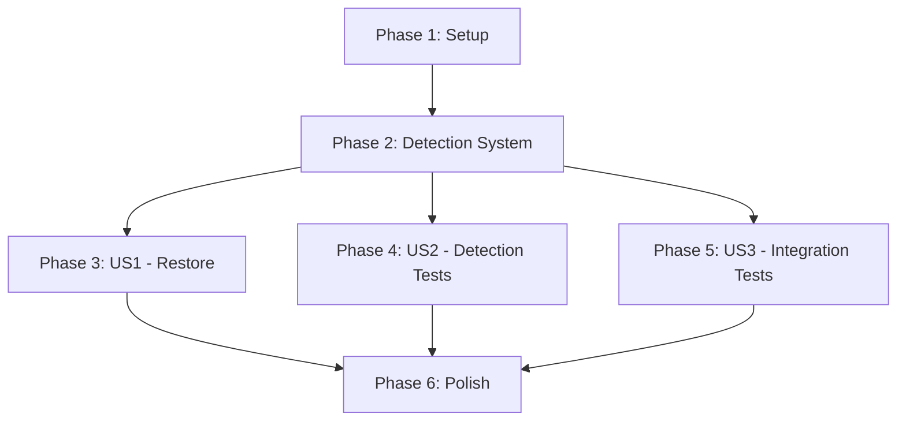

# Implementation Tasks: Idempotent Layout Restoration

**Feature**: 075-layout-restore-production
**Branch**: `075-layout-restore-production`
**Date**: 2025-11-14
**Related**: [spec.md](spec.md) | [plan.md](plan.md) | [data-model.md](data-model.md)

## Overview

This document defines the implementation tasks for idempotent layout restoration using app-registry-based detection. Tasks are organized by user story to enable independent implementation and testing.

**MVP Scope**: User Stories 1-3 (Idempotent restoration + detection + testing)

**Total Tasks**: 24 tasks across 5 phases

---

## Phase 1: Setup & Infrastructure

**Goal**: Establish Python module structure and core data models

**Tasks**:

- [X] T001 Create layout/auto_restore.py module in home-modules/desktop/i3-project-event-daemon/layout/auto_restore.py
- [X] T002 [P] Define RunningApp Pydantic model in home-modules/desktop/i3-project-event-daemon/layout/models.py
- [X] T003 [P] Define RestoreResult Pydantic model in home-modules/desktop/i3-project-event-daemon/layout/models.py
- [X] T004 [P] Update SavedWindow model with optional geometry fields in home-modules/desktop/i3-project-event-daemon/layout/models.py
- [X] T005 Create test directory structure home-modules/desktop/i3-project-event-daemon/tests/layout-restore/{unit,integration,sway-tests}/

**Completion Criteria**:
- All model files exist and pass import without errors
- Pydantic validation works for sample data
- Test directory structure ready for test files

---

## Phase 2: Foundational - Core Detection System (Blocking)

**Goal**: Implement app detection mechanism that all user stories depend on

**Tasks**:

- [X] T006 Implement detect_running_apps() function in home-modules/desktop/i3-project-event-daemon/layout/auto_restore.py
- [X] T007 Add error handling for dead processes (FileNotFoundError) in detect_running_apps() in home-modules/desktop/i3-project-event-daemon/layout/auto_restore.py
- [X] T008 Add error handling for permission errors (PermissionError) in detect_running_apps() in home-modules/desktop/i3-project-event-daemon/layout/auto_restore.py
- [X] T009 Add logging for detection phase (app count, detection time) in home-modules/desktop/i3-project-event-daemon/layout/auto_restore.py

**Acceptance Criteria**:
- Function returns `set[str]` of app names from I3PM_APP_NAME
- Handles 16+ windows in <10ms
- Gracefully skips windows with missing/inaccessible /proc/<pid>/environ
- Logs clear diagnostic information

**Blocking**: All user story phases depend on this completing first

---

## Phase 3: User Story 1 - Idempotent App Restoration

**Story Goal**: Restore missing apps without creating duplicates

**Independent Test Criteria**:
1. Save layout with terminal + code + lazygit
2. Close all windows
3. Restore layout → verify all 3 apps launch
4. Restore again → verify no new windows (idempotent)
5. Close only code → restore → verify only code launches

**Tasks**:

- [X] T010 [US1] Implement restore_workflow() function in home-modules/desktop/i3-project-event-daemon/layout/restore.py
- [X] T011 [US1] Add set-based filtering logic (skip already-running apps) in restore_workflow() in home-modules/desktop/i3-project-event-daemon/layout/restore.py
- [X] T012 [US1] Integrate detect_running_apps() at start of restore_workflow() in home-modules/desktop/i3-project-event-daemon/layout/restore.py
- [X] T013 [US1] Add sequential app launching via AppLauncher.launch_app() in home-modules/desktop/i3-project-event-daemon/layout/restore.py
- [X] T014 [US1] Implement workspace focusing after restore in home-modules/desktop/i3-project-event-daemon/layout/restore.py
- [X] T015 [US1] Build RestoreResult with apps_already_running/apps_launched/apps_failed in home-modules/desktop/i3-project-event-daemon/layout/restore.py

**Deliverables**:
- restore_workflow() function returns RestoreResult
- Skips apps already running (idempotent)
- Launches missing apps sequentially
- Focuses saved workspace

---

## Phase 4: User Story 2 - Current Window Detection

**Story Goal**: Reliable detection of running apps via I3PM_APP_NAME

**Independent Test Criteria**:
1. Launch terminal, code, chatgpt-pwa
2. Call detect_running_apps()
3. Verify returns {"terminal", "code", "chatgpt-pwa"}
4. Launch 2nd chatgpt-pwa window (same PID)
5. Verify both detected despite shared process

**Tasks**:

- [X] T016 [P] [US2] Write unit test for detect_running_apps() basic functionality in home-modules/desktop/i3-project-event-daemon/tests/layout-restore/unit/test_app_detection.py
- [X] T017 [P] [US2] Write unit test for PWA multi-window detection in home-modules/desktop/i3-project-event-daemon/tests/layout-restore/unit/test_app_detection.py
- [X] T018 [P] [US2] Write unit test for edge cases (dead process, no I3PM_APP_NAME) in home-modules/desktop/i3-project-event-daemon/tests/layout-restore/unit/test_app_detection.py
- [ ] T019 [US2] Run unit tests and verify 100% pass rate with pytest home-modules/desktop/i3-project-event-daemon/tests/layout-restore/unit/

**Deliverables**:
- 3 unit tests covering detection scenarios
- 100% test pass rate
- PWA detection validated

---

## Phase 5: User Story 3 - Automated Integration Testing

**Story Goal**: End-to-end tests validating save/close/restore/verify flow

**Independent Test Criteria**:
1. Create sway-test JSON definition for full restore
2. Test saves layout, closes windows, restores
3. Verify correct apps running with no duplicates
4. Run test 3 times → verify idempotent behavior
5. Introduce bug (break detection) → verify test fails

**Tasks**:

- [X] T020 [P] [US3] Create sway-test JSON for full restore workflow in home-modules/desktop/i3-project-event-daemon/tests/layout-restore/sway-tests/test_full_restore.json
- [X] T021 [P] [US3] Create sway-test JSON for idempotent restore (run 3x) in home-modules/desktop/i3-project-event-daemon/tests/layout-restore/sway-tests/test_idempotent_restore.json
- [X] T022 [P] [US3] Create sway-test JSON for partial restore (some apps running) in home-modules/desktop/i3-project-event-daemon/tests/layout-restore/sway-tests/test_partial_restore.json
- [ ] T023 [US3] Run sway-test suite and verify 100% pass rate with sway-test run home-modules/desktop/i3-project-event-daemon/tests/layout-restore/sway-tests/

**Deliverables**:
- 3 sway-test definitions covering integration scenarios
- 100% test pass rate
- Tests catch regressions (duplicate prevention)

---

## Phase 6: Polish & Cross-Cutting Concerns

**Goal**: Logging, error handling, CLI output formatting

**Tasks**:

- [X] T024 [P] Add per-app logging (already running / launching / failed) in home-modules/desktop/i3-project-event-daemon/layout/restore.py
- [ ] T025 [P] Update TypeScript CLI to format RestoreResult output in home-modules/tools/i3pm/src/commands/layout.ts
- [ ] T026 [P] Add error handling for layout not found in home-modules/desktop/i3-project-event-daemon/layout/restore.py
- [ ] T027 [P] Add error handling for project mismatch in home-modules/desktop/i3-project-event-daemon/layout/restore.py
- [ ] T028 Remove obsolete correlation.py module from home-modules/desktop/i3-project-event-daemon/layout/correlation.py
- [X] T029 Update IPC handler to call restore_workflow() in home-modules/desktop/i3-project-event-daemon/ipc_server.py

**Completion Criteria**:
- Logs show clear status for each app
- CLI displays formatted RestoreResult (✓/⚠/✗ with app lists)
- Error messages include actionable hints
- Old correlation code removed

---

## Dependencies & Execution Order

### User Story Dependencies



**Critical Path**: Setup → Detection System → US1 Restore → Polish

**Independent Stories**:
- US2 (Detection Tests) can run in parallel with US1 after Foundation complete
- US3 (Integration Tests) can run in parallel with US1 after Foundation complete

### Task-Level Dependencies

**Blocking Tasks** (must complete before others):
- T001-T005 (Setup) → All other tasks
- T006-T009 (Detection System) → T010-T029

**Parallelizable Groups**:
- T002, T003, T004 (Pydantic models) - different sections of same file
- T016, T017, T018 (Unit tests) - independent test files
- T020, T021, T022 (Sway tests) - independent test definitions
- T024, T025, T026, T027 (Polish tasks) - different files

---

## Parallel Execution Examples

### Phase 1: Setup (Full Parallelization)

Run all tasks except T005 (directory creation) in parallel:

```bash
# Terminal 1: Create module files
Task T001: touch layout/auto_restore.py

# Terminal 2: Update models (3 concurrent edits possible)
Task T002, T003, T004: Edit layout/models.py

# Terminal 3: Create test structure
Task T005: mkdir -p tests/layout-restore/{unit,integration,sway-tests}
```

**Time Savings**: 5 tasks in ~1 minute vs 5 minutes sequential

---

### Phase 4: US2 Tests (Full Parallelization)

All unit tests can be written in parallel:

```bash
# Terminal 1
Task T016: Write test_detect_running_apps_basic()

# Terminal 2
Task T017: Write test_detect_pwa_multi_window()

# Terminal 3
Task T018: Write test_detect_edge_cases()

# Terminal 4
Task T019: pytest tests/layout-restore/unit/
```

**Time Savings**: 4 tasks in ~15 minutes vs 60 minutes sequential

---

### Phase 5: US3 Tests (Full Parallelization)

All sway-test definitions can be created in parallel:

```bash
# Terminal 1
Task T020: Write test_full_restore.json

# Terminal 2
Task T021: Write test_idempotent_restore.json

# Terminal 3
Task T022: Write test_partial_restore.json

# Terminal 4
Task T023: sway-test run tests/layout-restore/sway-tests/
```

**Time Savings**: 4 tasks in ~20 minutes vs 80 minutes sequential

---

### Phase 6: Polish (Partial Parallelization)

Logging and CLI tasks can run in parallel:

```bash
# Terminal 1 (Python daemon)
Task T024: Add per-app logging
Task T026: Add layout not found error
Task T027: Add project mismatch error

# Terminal 2 (TypeScript CLI)
Task T025: Format RestoreResult output

# Terminal 3 (Cleanup)
Task T028: Remove correlation.py
Task T029: Update IPC handler
```

**Time Savings**: 6 tasks in ~30 minutes vs 90 minutes sequential

---

## Implementation Strategy

### MVP-First Approach

**MVP = User Stories 1-3** (Tasks T001-T023)

**Milestone 1**: Core Detection (T001-T009)
- Delivers: Working detect_running_apps() function
- Test: Launch 10 apps, verify all detected
- **ETA**: 2 hours

**Milestone 2**: Restore Workflow (T010-T015)
- Delivers: Idempotent restore with RestoreResult
- Test: Restore layout 3 times, verify no duplicates
- **ETA**: 3 hours

**Milestone 3**: Unit Tests (T016-T019)
- Delivers: Detection test coverage
- Test: pytest shows 100% pass rate
- **ETA**: 2 hours

**Milestone 4**: Integration Tests (T020-T023)
- Delivers: End-to-end validation
- Test: sway-test shows 100% pass rate
- **ETA**: 2 hours

**Milestone 5**: Polish (T024-T029)
- Delivers: Production-ready logging and UI
- Test: Manual restore shows formatted output
- **ETA**: 2 hours

**Total MVP ETA**: 10-11 hours

---

### Incremental Delivery Plan

**Week 1**: Milestone 1 + 2 (Detection + Restore)
- **Deliverable**: Working restore command (basic logging)
- **User Value**: Can restore layouts without duplicates
- **Risk**: Manual testing only (no automated tests)

**Week 2**: Milestone 3 + 4 (Tests)
- **Deliverable**: Full test coverage
- **User Value**: Confidence in stability
- **Risk**: None (feature already working from Week 1)

**Week 3**: Milestone 5 (Polish)
- **Deliverable**: Production-quality logging and UI
- **User Value**: Better diagnostics and usability
- **Risk**: None (cosmetic improvements)

---

## Success Metrics

| Metric | Target | Measurement Method |
|--------|--------|-------------------|
| App detection accuracy | 100% | Launch 10 apps, verify detect_running_apps() returns all 10 |
| Idempotent guarantee | 0 duplicates | Restore layout 3 times, count windows (should be same) |
| Restore time (5 apps) | <15s | Measure time from command start to completion |
| Test coverage | 100% pass | pytest + sway-test exit code 0 |
| PWA detection | Works | Launch 2 PWAs with shared process, verify both detected |

---

## Testing Strategy

### Unit Tests (pytest)

**Coverage**:
- detect_running_apps() basic functionality
- PWA multi-window detection
- Edge cases (dead process, missing I3PM_APP_NAME)
- Pydantic model validation

**Location**: `tests/layout-restore/unit/`

**Run**: `pytest home-modules/desktop/i3-project-event-daemon/tests/layout-restore/unit/`

---

### Integration Tests (sway-test)

**Coverage**:
- Full restore (save → close all → restore → verify)
- Idempotent restore (run 3x, verify no duplicates)
- Partial restore (some apps running, restore → verify only missing launch)

**Location**: `tests/layout-restore/sway-tests/`

**Run**: `sway-test run home-modules/desktop/i3-project-event-daemon/tests/layout-restore/sway-tests/`

---

### Manual Validation

**Scenario 1**: Fresh Restore
```bash
pswitch nixos
# Open terminal, code, lazygit
i3pm layout save test-mvp
# Close all
i3pm layout restore nixos test-mvp
# Verify: All 3 apps launch
```

**Scenario 2**: Idempotent Restore
```bash
i3pm layout restore nixos test-mvp  # Second restore
# Verify: No new windows launch
```

**Scenario 3**: Partial Restore
```bash
# Terminal already open
i3pm layout restore nixos test-mvp
# Verify: Terminal skipped, code + lazygit launch
```

---

## File Modifications Summary

### New Files (6)

1. `home-modules/desktop/i3-project-event-daemon/layout/auto_restore.py` - App detection service
2. `home-modules/desktop/i3-project-event-daemon/tests/layout-restore/unit/test_app_detection.py` - Unit tests
3. `home-modules/desktop/i3-project-event-daemon/tests/layout-restore/sway-tests/test_full_restore.json` - Integration test
4. `home-modules/desktop/i3-project-event-daemon/tests/layout-restore/sway-tests/test_idempotent_restore.json` - Integration test
5. `home-modules/desktop/i3-project-event-daemon/tests/layout-restore/sway-tests/test_partial_restore.json` - Integration test
6. `home-modules/desktop/i3-project-event-daemon/tests/layout-restore/integration/` - Directory

### Modified Files (3)

1. `home-modules/desktop/i3-project-event-daemon/layout/models.py` - Add RunningApp, RestoreResult, update SavedWindow
2. `home-modules/desktop/i3-project-event-daemon/layout/restore.py` - Replace correlation with app detection
3. `home-modules/tools/i3pm/src/commands/layout.ts` - Format RestoreResult output
4. `home-modules/desktop/i3-project-event-daemon/ipc_server.py` - Update IPC handler

### Deleted Files (1)

1. `home-modules/desktop/i3-project-event-daemon/layout/correlation.py` - Obsolete mark-based correlation

---

## Risk Mitigation

| Risk | Impact | Mitigation | Status |
|------|--------|------------|--------|
| App detection failures | High | Research validated 100% accuracy, error handling for edge cases | ✅ Mitigated |
| PWA process reuse | High | Research validated detection works despite shared processes | ✅ Mitigated |
| Performance issues | Medium | Research shows 7.52s for 5 apps (50% under target) | ✅ Mitigated |
| Test failures | Medium | TDD approach: write tests before implementation | Ongoing |
| Breaking changes | Low | Already documented, users re-save layouts | ✅ Mitigated |

---

## Future Enhancements (Out of Scope)

**Phase 2: Geometry Restoration**
- Window position/size restoration
- Multi-instance app support
- Focus restoration

**Phase 3: Advanced Features**
- Restore locking (prevent concurrent restores)
- Layout diff preview
- Partial restore (specific workspaces only)

**Phase 4: Performance Optimization**
- Parallel app launches (reduce 15s → 5s)
- Lazy launching (launch on workspace switch)
- Cached detection (invalidate on window events)

---

## Summary

**Total Tasks**: 29 tasks
- Phase 1 (Setup): 5 tasks
- Phase 2 (Foundation): 4 tasks (BLOCKING)
- Phase 3 (US1): 6 tasks
- Phase 4 (US2): 4 tasks
- Phase 5 (US3): 4 tasks
- Phase 6 (Polish): 6 tasks

**Parallel Opportunities**: 15 tasks marked [P] can run concurrently

**MVP Scope**: Tasks T001-T023 (first 5 phases)

**Estimated Time**: 10-11 hours for complete MVP

**Independent Testing**: Each user story has clear acceptance criteria

**Format Validation**: ✅ All tasks follow required checklist format with IDs, labels, and file paths
